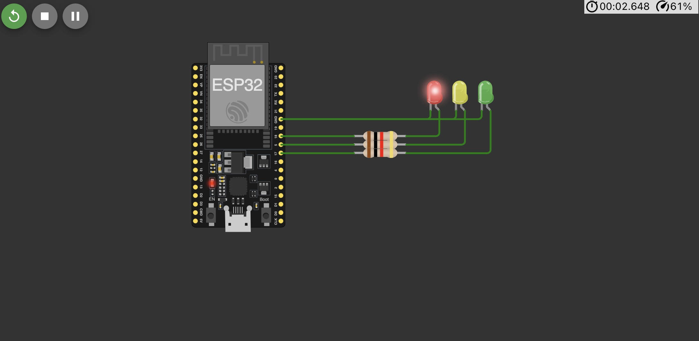

# 📌 Tugas Praktik IoT: Traffic Light 🚦

> **Nama:** Anas Khalif Muttaqien  
> **NIM:** 233140707111105

## 📖 **Deskripsi Proyek**

Proyek ini mensimulasikan sistem **lampu lalu lintas** berbasis **ESP32** menggunakan **Wokwi**. Simulasi ini menampilkan lampu merah, kuning, dan hijau yang menyala secara bergantian sesuai dengan aturan lalu lintas di Indonesia.

---

## 🛠 **Diagram Wokwi**

Berikut adalah diagram koneksi proyek dalam format **JSON** untuk digunakan langsung di **Wokwi Simulator**.

📷 **Diagram Wokwi:**  


```json
{
  "version": 1,
  "author": "Uri Shaked",
  "editor": "wokwi",
  "parts": [
    {
      "type": "board-esp32-devkit-c-v4",
      "id": "esp",
      "top": 0,
      "left": 0,
      "attrs": {}
    },
    {
      "type": "wokwi-resistor",
      "id": "r1",
      "top": 109.55,
      "left": 182.4,
      "attrs": { "value": "1000" }
    },
    {
      "type": "wokwi-resistor",
      "id": "r2",
      "top": 99.95,
      "left": 182.4,
      "attrs": { "value": "1000" }
    },
    {
      "type": "wokwi-resistor",
      "id": "r3",
      "top": 119.15,
      "left": 182.4,
      "attrs": { "value": "1000" }
    },
    {
      "type": "wokwi-led",
      "id": "led1",
      "top": 34.8,
      "left": 253.4,
      "attrs": { "color": "red" }
    },
    {
      "type": "wokwi-led",
      "id": "led2",
      "top": 34.8,
      "left": 282.2,
      "attrs": { "color": "yellow" }
    },
    {
      "type": "wokwi-led",
      "id": "led3",
      "top": 34.8,
      "left": 311,
      "attrs": { "color": "limegreen" }
    }
  ],
  "connections": [
    ["esp:TX", "$serialMonitor:RX", "", []],
    ["esp:RX", "$serialMonitor:TX", "", []],
    ["esp:17", "r3:1", "green", ["h0"]],
    ["esp:18", "r2:1", "green", ["h0"]],
    ["esp:5", "r1:1", "green", ["h0"]],
    ["r2:2", "led1:A", "green", ["h37.2", "v-19.2"]],
    ["r1:2", "led2:A", "green", ["h66", "v-28.8"]],
    ["r3:2", "led3:A", "green", ["h94.8", "v-38.4"]],
    ["led1:C", "esp:GND.3", "green", ["v0"]],
    ["led2:C", "esp:GND.3", "green", ["v0"]],
    ["led3:C", "esp:GND.3", "green", ["v0"]]
  ],
  "dependencies": {}
}
```

---

## 📝 **Kode Program ESP32**

Berikut adalah kode untuk mengontrol **lampu lalu lintas** dengan durasi sesuai aturan lalu lintas di Indonesia:

```cpp
#include <Arduino.h>

int ledm = 18; // Pin LED Merah
int ledk = 5;  // Pin LED Kuning
int ledh = 17; // Pin LED Hijau

void setup() {
  Serial.begin(115200);
  pinMode(ledm, OUTPUT);
  pinMode(ledk, OUTPUT);
  pinMode(ledh, OUTPUT);
}

void loop() {
  digitalWrite(ledm, HIGH);
  digitalWrite(ledk, LOW);
  digitalWrite(ledh, LOW);
  Serial.println("\n🔴 Merah Menyala (20 detik)");
  delay(30000);

  digitalWrite(ledm, LOW);
  digitalWrite(ledk, HIGH);
  digitalWrite(ledh, LOW);
  Serial.println("\n🟡 Kuning Menyala (3 detik)");
  delay(3000);

  digitalWrite(ledm, LOW);
  digitalWrite(ledk, LOW);
  digitalWrite(ledh, HIGH);
  Serial.println("\n🟢 Hijau Menyala (20 detik)");
  delay(20000);
}
```

---

## 🚀 **Cara Menjalankan di Wokwi**

1. Buka [Wokwi ESP32 Simulator](https://wokwi.com/).
2. Buat proyek baru dan pilih **ESP32**.
3. **Salin dan tempel** JSON diagram ke dalam file `diagram.json`.
4. **Salin dan tempel** kode C++ ke dalam file `main.cpp`.
5. Klik tombol **RUN** ▶ untuk menjalankan simulasi.

---

## 📌 **Kesimpulan**

Proyek ini berhasil mensimulasikan **lampu lalu lintas** berbasis **ESP32** dengan urutan nyala:
✅ **Merah:** 30 detik  
✅ **Kuning:** 3 detik  
✅ **Hijau:** 20 detik

---

🔗 **Dibuat dengan oleh Anas Khalif Muttaqien**
